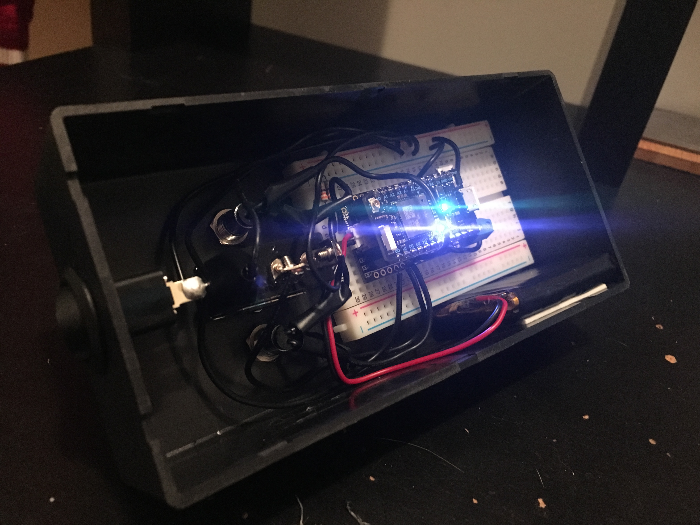
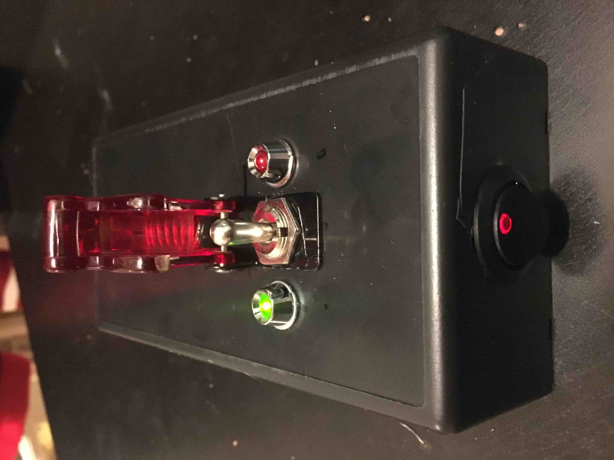
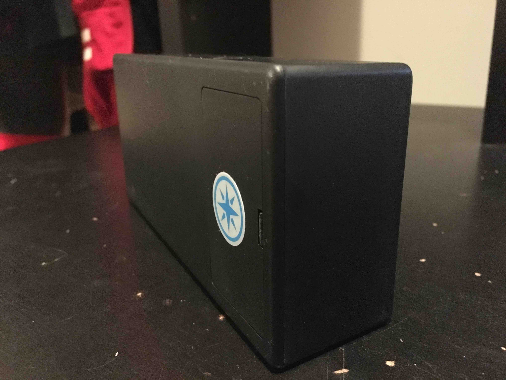

# Doomsday Switch
Arduino IoT light switch

Small weekend project I built with [@jusleg](https://github.com/jusleg)

Components:
* Particle Photon
* Philips Hue light bulbs :bulb:
* Missile Switch
* Pizza :pizza:
