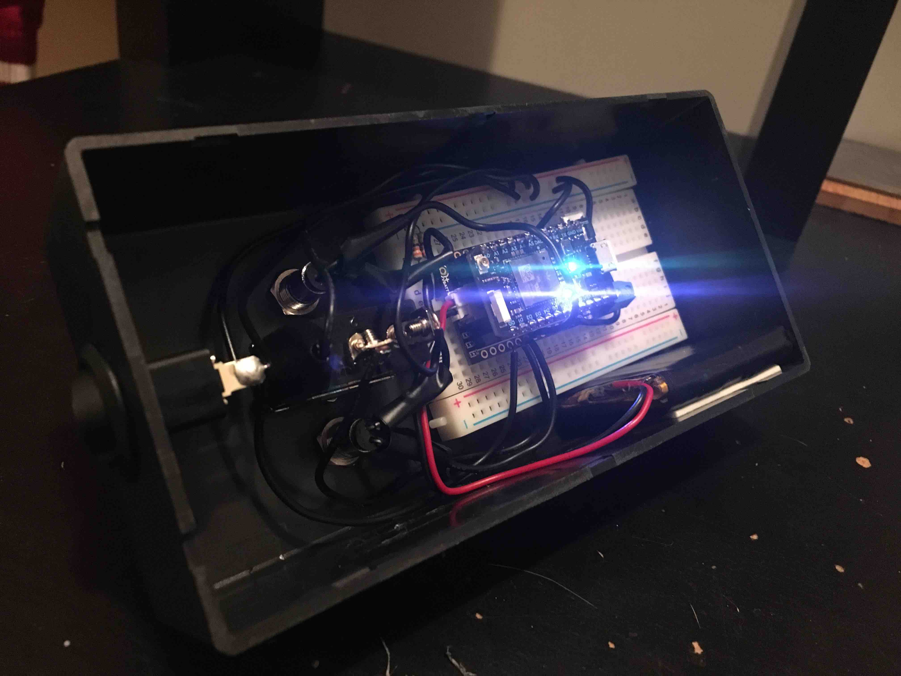

# Doomsday Switch
Arduino IoT light switch

Small weekend project I built with [@kcamcam](https://github.com/kcamcam)

Components:
* Particle Photon
* Philips Hue light bulbs :bulb
* Missile Switch
* Pizza :pizza:
